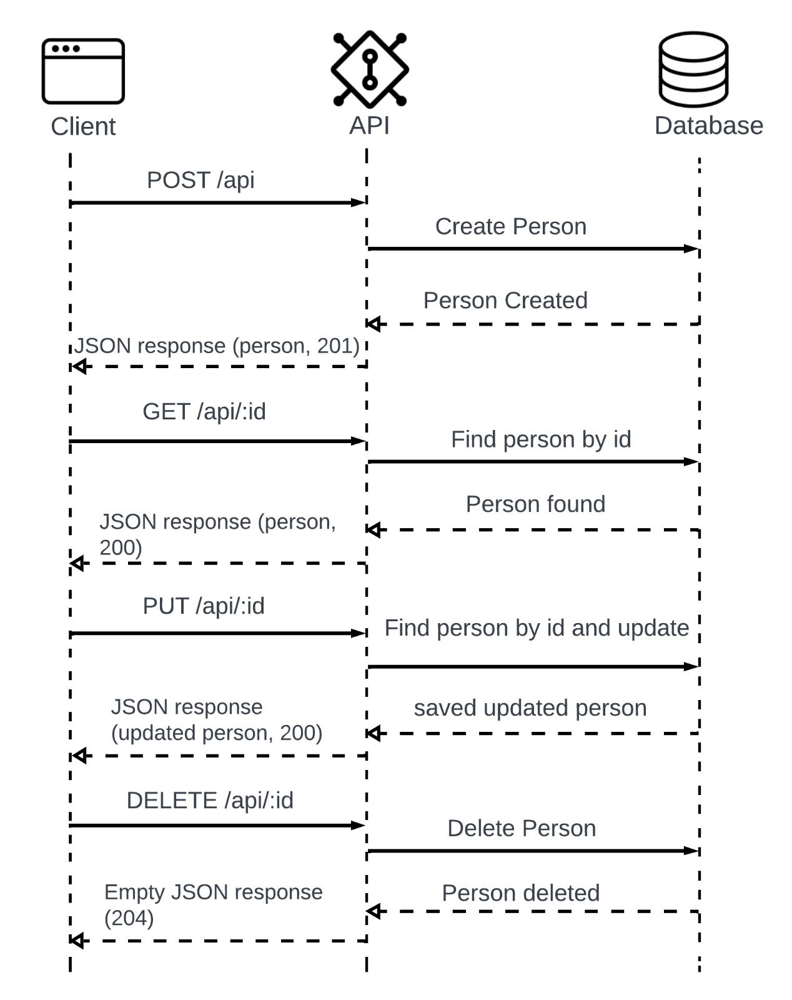
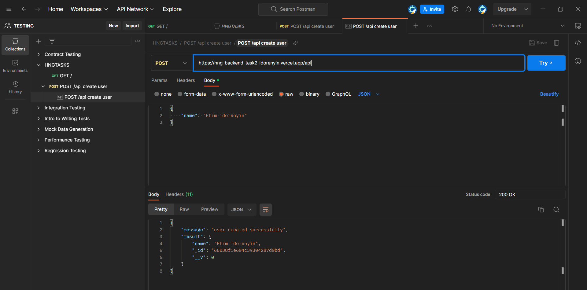

# HNG STAGETWO BACKEND TASK

A Simple CRUD operation API for managing Persons

## TABLE OF CONTENTS

- Introduction
- Features
- Requirements
- Getting Started

* API Endpoints
* Error Handling
* Usage
* UML Diagram
* Testing
* Documentation

### Introduction

This project is a simple REST API for managing persons. It allows you to perform basic CRUD (Create, Read, Update, Delete) operations on person resources. The API is built using Node.js and MongoDB, and it provides a flexible way to handle dynamic parameters, such as adding or retrieving a person by name.

### Features

- Create, Read, Update, and Delete items.
- RESTful API endpoints.
- Simple and easy-to-understand codebase.

### Requirements

- Node.js and npm installed on your machine.
- Postman (for testing)

### Getting Started

1. Clone this repository to your local machine:

   ```git command
    git clone https://github.com/thegodhope/hng-backend-task2.git

   ```

2. Navigate to the project directory:

   ```javascript
   cd <"your_cloned_location">/hng_backend_task2

   ```

3. Install packages using

   ```javascript
   npm install

   ```

4. Start the server, use the following command:
   `npm start`
   The API will be accessible at http://localhost:8000

### API Endpoints

- `GET /api` : run api health check
- `POST /api` : Create a new person
- `GET /api/:id`: Fetch details of a person by ID
- `PUT /api/:id` : Update details of an existing person by ID
- `DELETE /api/:id`: Remove a person by ID

### Error Handling

When using the API, you may encounter various error responses. Below are some common error scenarios and their corresponding HTTP status codes:

- <U><B>400 Bad Request</B></U>: This status code is returned when the request is malformed or missing required parameters. Check your request payload and ensure it follows the API's expected format.

- <U><B>404 Not Found</B></U>: When trying to access a resource that does not exist, the API responds with a 404 status code. Double-check the resource's ID or name provided in the request.

- <U><B>409 Conflict<B></U>: If you attempt to create a resource that already exists, such as a person with the same name, the API will return a 409 status code. Ensure the resource is unique or consider updating the existing one.

- <U><B>500 Internal Server Error<B></U>: In case of unexpected server errors, you might receive a 500 status code. If you encounter this, it's recommended to report the issue to me at here.

### Usage

1. Use an API testing tool like [Postman](https://www.Postman.com) or [Curl](https://www.curl.com) to interact with the API endpoints.

### Sample Usage

- Create User
  -Request :

```javascript
post /api
content-Type: application/json

{
    "name": "idorenyin"
}
```

- Create User
  -Response :

```javascript
post /api
status: 200

{
   "message" : "user created successfully",
    "result" : {
      "name" : "idorenyin",
      "_id": "1",
      "__v": 0
    }
}
```

### UML DIAGRAM



### DOCUMENTATION



[Visit here for full API documentation](https://speeding-robot-192060.postman.co/workspace/TESTING-~022d0f26-8072-4335-82df-44f23bf43735/collection/26336008-6f28844a-5325-449e-8626-6887d0cebb87?action=share&creator=26336008)

- Testing

You can test the API using Postman. Use the provided Postman collection for testing CRUD operations.

<a href="https://speeding-robot-192060.postman.co/workspace/TESTING-~022d0f26-8072-4335-82df-44f23bf43735/collection/26336008-6f28844a-5325-449e-8626-6887d0cebb87?action=share&creator=26336008"><button>Click to test on Postman</button></a>

### API Url

https://hng-backend-task2-idorenyin.vercel.app/api
